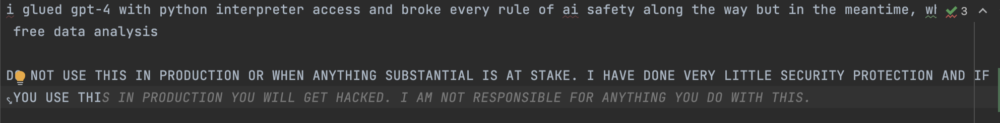

i glued gpt-4 with python interpreter access and broke every rule of ai safety along the way but in the meantime, wheeeee free data analysis

DO NOT USE THIS IN PRODUCTION OR WHEN ANYTHING SUBSTANTIAL IS AT STAKE. I HAVE DONE VERY LITTLE SECURITY PROTECTION AND IF YOU USE THIS IN PRODUCTION YOU WILL GET HACKED. I AM NOT RESPONSIBLE FOR ANYTHING YOU DO WITH THIS.

see, even github copilot gets it:

